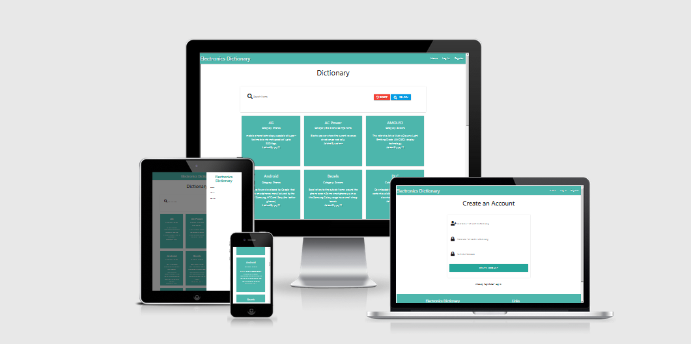

# Milestone Project 3 - Electronics Dictionary
View the live project [here](https://electronics-dictionary.herokuapp.com/).

# Table of Contents
* [Electronics Dictionary Summary](#electronics-dictionary-summary)
* [User Experience](#user-experience)
* [User Stories](#user-stories)
* [Design](#design)
* [Technologies Used](#technologies-used)
* [Features](#features)
* [Testing](#testing)
* [Deployment](#deployment)
* [Credits](#credits)
* [Acknowledgements](#acknowledgements)
***
 
# Electronics Dictionary Summary

This is my third milestone project out of 4 in the Code Institute Full Stack Developer course
where I have designed and developed a web app with the use of Frontend and Backend technologies. 
My goals with this web app is to teach people all about the terminology behind electronics.
I have taken my knowledge learned from the Full Stack Software Developer course, 
(HTML, CSS, JavaScript, Python, Bootstrap, MongoDB) to provide a clear,
functioning and responsive web application that 
demonstrates a proficient use of HTML5, Python and MongoDB, with slight uses of CSS3 and JavaScript. 
The Bootstrap Framework was used along side
these programming languages to help give
the site a clear strucutre and ensure the site has a high standard of responsiveness on desktop, tablet and
mobile devices.

*Electronics Dictionary* is a project for a web application to help people who might not understand the terminology 
behind electronics.
Be it , computers , phones, screens etc. The app acts as a dictionary to help teach others about electronics and 
technology as a whole, which is where the majority of my passion is.

The full site is deployed to Heroku, and you can visit it [here](https://electronics-dictionary.herokuapp.com/).

## **User Experience**
Electronics Dictionary AmIResponsive

## User Stories

* First Time Visitor Goals :
    * As a first time visitor, I want to easily understand the purpose for this sight.
    * As a first time visitor, I want to easily navigate through the site to find content.
    * As a first time visitor, I want to have the ability to find their social medie links, wether it be Github or LinkedIn

* Returning Visitor Goals
    * As a returning visitor, I want to find new items and terms within the dictionary.
    * As a returning visitor, I want to find the easiest way to create an account within the app.
    * As a returning visitor, I want to find social media links related to the developer.
    * As a frequent visitor, I want to have the ability to Create, Read, Update and Delete my items.
    * As a frequent visitor, I want to have the ability to delete my account.

* Frequent Visitor Goals
    * As a frequent visitor, I want to see if there are any newly added items or terms.
    * As a frequent visitor, I want to have easy access to Log In and Log Out functionalty.
    * As a frequent visitor, I want to have the ability to Create, Read, Update and Delete my items.
    * As a frequent visitor, I want to have the ability to delete my account.

* For the user, the site assists in meeting the user goals by:
    * Presenting a clean website that's easy-on-the-eye, providing smooth navigation with the use of a fixed navbar.
    This enables them to click between the pages at all times. The user can also click on the logo from
    any page to take them back to the home page.
    * Providing a clean, basic form that doesn't overwhelm or confuse the user which they can fill out to submit their own dictionary item to the web app.
    * The user can add their own account which enable them to create their own dictionary items and also allows them to edit and delete said items.
    * The user can easily log in/out of their profile and navigate to the developers social links.

[Back to Top](#table-of-contents)

## Design

* Color Scheme
    * The main colors for the web app are Materialize White, And Materialize Teal ( #ffffff white, #009688 teal)

* Typography
    * The Arial font is the main font used throughout the whole web app, I used Arial because it is a stock HTML font and fits the design perfectly.

* Imagery 
    * Imagery is not used much throughout the site, I used an image for the favicon which I aquired [here](https://www.freelogodesign.org/).

* Wireframes
    * [Home Page Wireframes ](https://www.figma.com/file/yI9OeRko7aIyWm06MkR1bI/Electronics-Dictionary-Home?node-id=0%3A1)
    * [Log In/Register Wireframes](https://www.figma.com/file/hptXIza06wqdejhCGHEo5p/Login%2F-Register?node-id=0%3A1)
    * [Profile Wireframes ](https://www.figma.com/file/LSUof5EGikoTF5KROBFwnG/Profile?node-id=0%3A1)

## Features

* Responsive on all devices
* Ability to create an account
* CRUD functionalty to Create, Read, Update and Delete items.
* Ability to edit and delete items.
* Ability to delete the users account.

## Technologies Used
### Languages Used
- [HTML5](https://html.com/)
- [CSS3](https://en.wikipedia.org/wiki/CSS)
- [JavaScript](https://www.javascript.com/)
- [Python](https://www.python.org/)

[Back to Top](#table-of-contents)

### Frameworks, Libraries & Programs Used
1. [Materialize ](https://materializecss.com/)
    * Materialize was used to style the web app to my needs.
2. [Font Awesome ](https://fontawesome.com/)
    * Font Awesome was used to get the icons I used throughout the web app.
3. [JQuery ](https://jquery.com/)
    * JQuery was used to initialize alot of the features and for form validation.
4. [Github ](https://github.com/)
    * GitHub was used to store my project code and connected to heroku for deployment.
5. [Figma ](https://www.figma.com/file/LSUof5EGikoTF5KROBFwnG/Profile?node-id=0%3A1)
    * Figma was used to create the wireframes.
6. [Heroku ](https://www.heroku.com/)
    * Heroku was used to deploy my project. 
7. [Flask ](https://flask.palletsprojects.com/en/1.1.x/)
    * Flask was used as the Framework in regard to the functions.
8. [Jinja ](https://jinja.palletsprojects.com/en/2.11.x/)
    * Jinga was used as the templating language for Python.
9. [Mongo Db Atlas ](https://www.mongodb.com/)
    * Mongo DB Atlas was used as the database to store the items, usernames and categories.
10. [Werkzeug ](https://werkzeug.palletsprojects.com/en/1.0.x/)
    * Werkzeug was used to hash user passwords
11. [Favicon.io ](https://favicon.io/)
    * favicon.io was used to add a favicon to the site.
12. [Am I responsive](http://ami.responsivedesign.is/)
    * Used to get the responsive picture at the top of the MD file.

## Testing
 - I manually tested the site for errors by availing of the Google Chrome Developer Tools.
 - To ensure the sight has valid HTML5 code I validated it [here.](https://validator.w3.org/)
 - To ensure the sight has valid CSS3 code I validated it [here.](https://validator.w3.org/)
 - To ensure the sight has valid JQuery code I validated it [here.](https://validator.w3.org/)
 - To ensure the sight has valid Python code I validated it [here.](http://pep8online.com/checkresult)
 - To make sure that Python, Flask, Jinja code remained error-free, the Debug console was set to 'True' throughout 
   the entirety of the development process. Pylint was also used to identify potential problems. I then set the Debug=False as I deplyed my project.
 - To ensure the site's functionality across various devices, I used the web developer tools on Google Chrome, Firefox and Samsung Internet.
 - I checked the responsiveness for my site on the following devices:
* Samsung Galaxy S21 Ultra - 6.8" 1440 x 3200 pixel density
* Samsung Galaxy Tab S7 - 11" 1600 x 2560 pixel density
* MacBook Pro - 15" 3200 x 2560 pixel density
- All of the above devices were flawless with the site.

[Back to Top](#table-of-contents)

## Bugs And Fixes

The "Electronics Dictionary" navbar text would overlap on smaller devices, so to fix that I added a media 
query within my CSS file where it would block the text on devices smaller than 640px, 
but it would display when you pull across on the menu.

## Deployment
### I deployed Electronics Dictionary to Heroku. As I done it, I took the following steps:
1. Set up a requirements.text file on GitPod by typing pip3 freeze –local > requirements.txt into the command line.
2. Added the Procfile by typing echo web: python app.py > Procfile into the command line.
3. Logged into Heroku.com and, from the dashboard, clicked on create app.
4. Entered the unique app name of electronics-dictionary.
5. Selected the region of Europe.
6. Clicked the create app button.

### To connect the app I took the following steps:
1. Clicked connect to GitHub to set up automatic deployment from the GitHub repository.
2. Added my GitHUb username and repository name of jacksheehy15 and electronics_dicionary.
3. Clicked search to find the repository.
4. Clicked connect to connect the app to the repository.
5. Clicked the settings tab for the app.
6. Clicked the reveal config vars button.
7. Added the following variables:
    - IP, with the value of 0.0.0.0.
    - PORT, with the value of 5000.
    - SECRET_KEY, with the value from the env.py file.
    - MONGO URI, with the value left blank at this stage.
    - MONGO_DBNAME, with the value of electronics-dictionary.
8. On Heroku, clicked "Enable automatic deployment" then Deploy branch.

### Pushed the new files to my repository on GitHub, to do so I done:
1. Typed git add requirements.txt" then git commit -m "Add requirements.txt." into the command line.
2. Typed git add Procfile then git commit –m "Add Procfile" into the command line.
3. Typed git push.

[Back to Top](#table-of-contents)

### To run the code locally, one may take the following steps:
1. Open my [repository](https://github.com/jacksheehy15/electronics-dictionary)
2. Click the green "Code" button.
3. Click the clipboard icon to copy the project URL.
4. Open a terminal in GitPod, or other IDE.
5. Open the file you wish to clone to.
6. Enter the following command into the terminal:
$ git clone https://github.com/jacksheehy15/electronics-dictionary

## Credits 

### Site Information Credit:
Screen items - https://wiki.analog.com/university/courses/electronics/text/glossary .
Computers items - https://www.vanderbilt.edu/AnS/physics/brau/KC/Computer%20terminology.html .
Electronic Component items - https://wiki.analog.com/university/courses/electronics/text/glossary .
Gaming items - https://www.makeuseof.com/tag/learn-the-lingo-common-gaming-terms-you-should-know/ .
Audio and Video items - https://www.cs.columbia.edu/~hgs/rtp/glossary.html .

## Acknowledgements
- A massive thanks to my Mentor, Antonio Rodriguez who gave me plenty of feedback and pointed me in the right direction all the time.
- A thank you to the Code Institute Student Care team, the CI Tutor team and of course, the CI Slack channel that were there to answer some very stupid questions!
- Also a thanks to my ex-mentor Seun Owinokoko for helping me get this far.

[Back to Top](#table-of-contents)

 